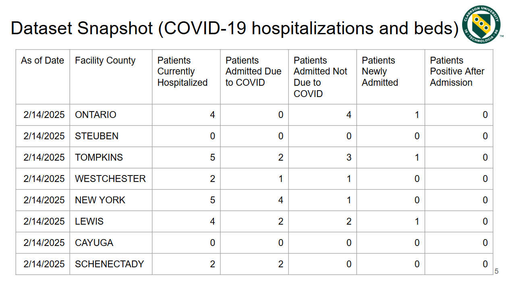
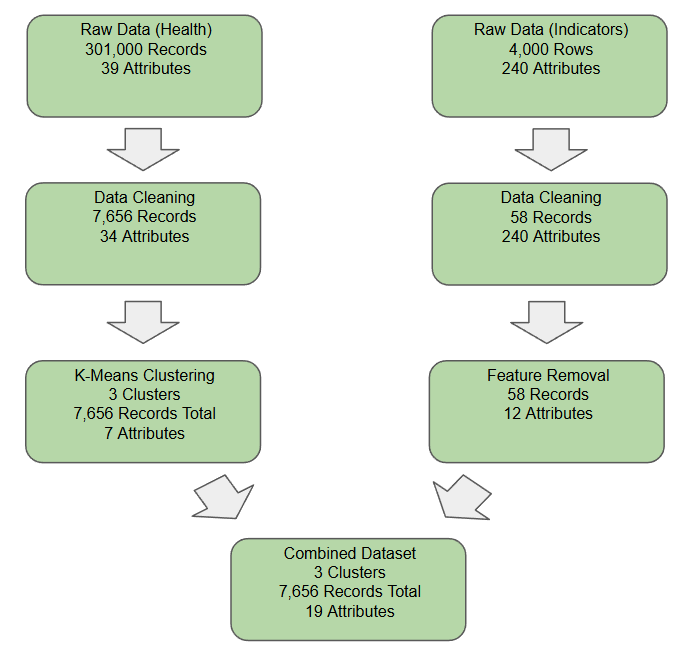
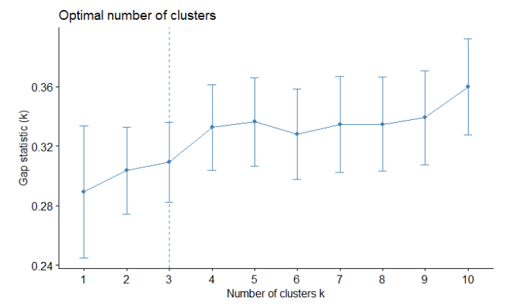
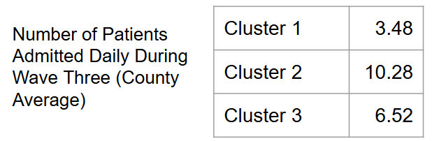
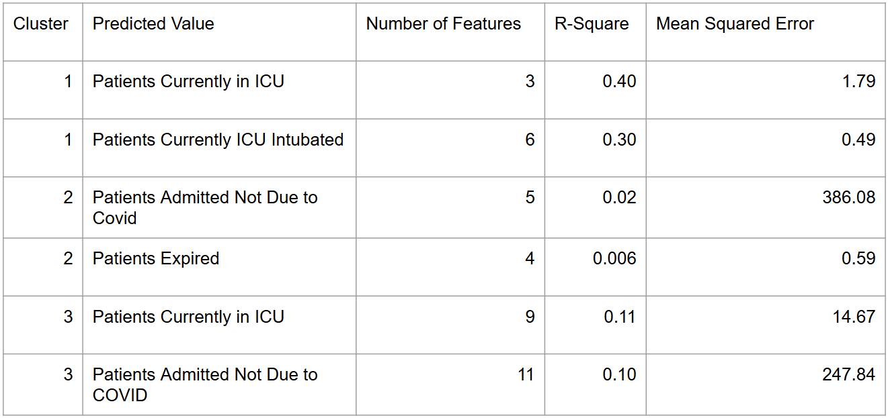
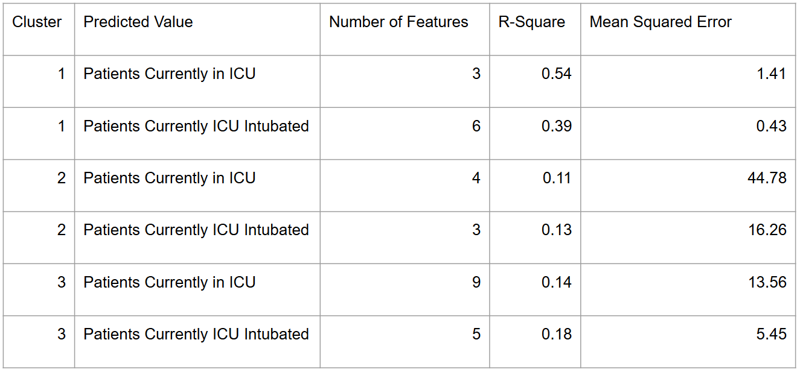
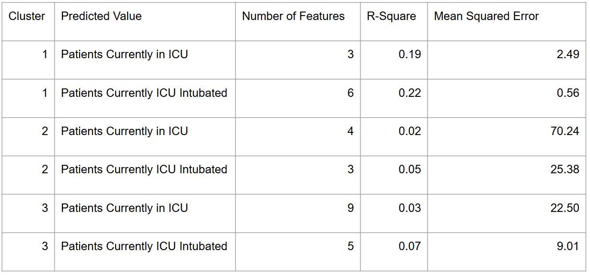

# New York State Covid 19 Wave 3 Research

## Data Sources

- New York State Department of Health COVID-19 Hospitalization Dataset (300,000 rows of daily hospital intake information)

- U.S. Census Bureau "American Community Survey (2017 - 2021)" (four separate Data Sets combined into one)

## Pre Processing

Main Technique used are

- K-Means Clustering 

- Pearson Correlation / Significance Testing

- Linear Regression

- Decision Tree Regression

- Random Forest Regression

Processing Map

## Results

- K-Means

 - Cluster Optimization

 

 - New York State Counties by Cluster

 

 - Cluster Averages Example

 

- Linear Regression Results

- Decision Tree Results

- Random Forest Results

## Additional Notes

Please refer to the research paper in the depository for further information.