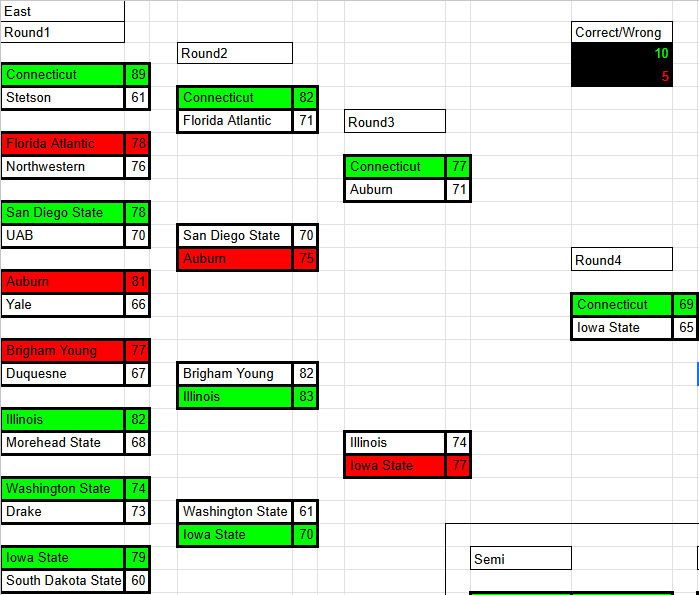

# NCAA Basket Ball Model Version 1

## What is this Model

- This model predicts the full March Madness tournament

- It provides the Winner and the score of every game

- It also fills the bracket automatically so repeated input is not necessary

## Model Results

2023

- 65% Prediction Accuracy Overall 

- Winner of Tournament Predicted Correctly

Bracket 

East

MidWest

South

West

Final Four

2024

- 71% Prediction Accuracy Overall 

- Winner of Tournament Predicted Incorrectly

Bracket 

## Future Plans

- None for the time being (Other Projects are more Interesting Right now)