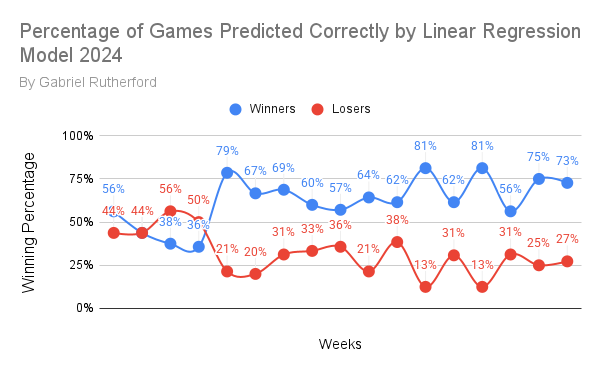
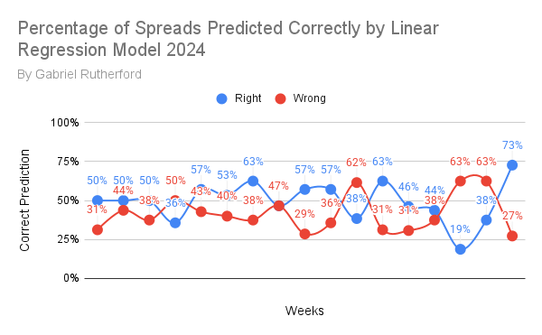
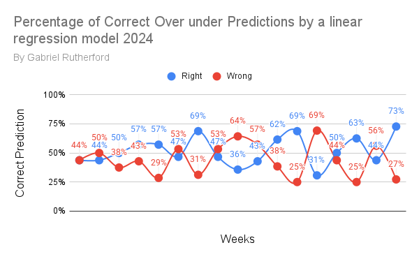

NFL Model Version 5

Changes from Pervious Versions Include:

-Faster Extract Transform Load Process

-Improved Linear Regression

-Early Neural Network Concept for Future use

This model can predict the Winner, Spread and Over Under for any given NFL game

The model Utilizes a bunch of stats from pro football focus to make these determinations.

The results for the 2024 Season are as follows

-Winners Correct 62% Overall and 68% when excluding weeks 1-5

-Spreads Correct 49% Overall and 50% when excluding weeks 1-5

-Over Unders Correct 52% Overall and 53% when excluding weeks 1-5

Future Plans

-Create New Data Points Using Existing Stats

-Finish testing on tne Neural Network 

-Improve Model Accuracy for Spreads and Over Under's 

Long Term Plans

-Attempt use of New model Types (Random Forest, SVR, SVC, Logistic Regression)