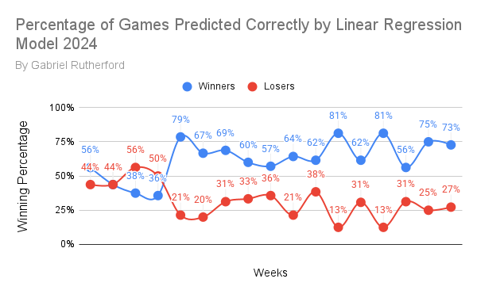

NFL Model Version 5

Changes from Pervious Versions Include:

-Faster Extract Transform Load Process

-Improved Linear Regression

-Early Neural Network Concept for Future use

This model can predict the Winner, Spread and Over Under for any given NFL game

The model Utilizes a bunch of stats from pro football focus to make these determinations.

The results for the 2024 Season are as follows

-Winner Correct 62% Overall and 68% when excluding weeks 1-5

