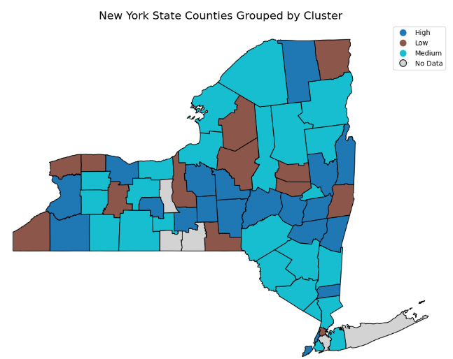
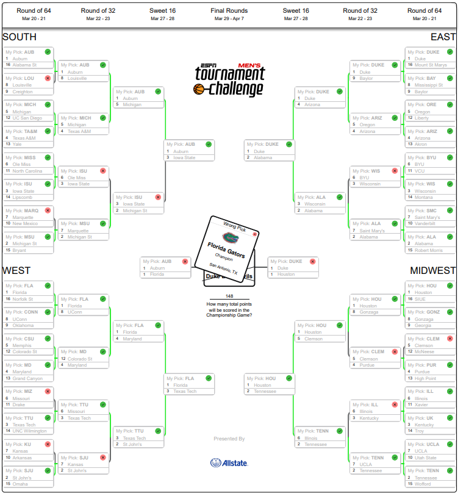

Main Projects

- NFL Prediction Model

 - Predicted the correct winner of a game 68% of the time for the 2024 season

 

- New York State Covid 19 Wave 3 Research

 - Examination of Hospitalization Trends During Wave 3 in New York State by County

 

- NCAA Basket Ball Prediction Model

 - Predicted the correct winner of a game 71% of the time for the 2025 march madness tournament

 

- Data Ware House and Operational Data Base with ETL Process

 - Just an SQL code base.