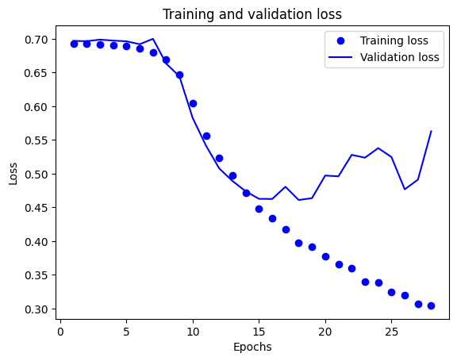

# 2024_ia651_Rutherford

# The Dataset

-Motivation

The dataset was selected because I wanted to examine the effect that more dramatic language has on sentiment analysis.

-Situation

The dataset consists of tweets so it is largely based on social media communication.

-Language Variety

The dataset consists of tweets from the United States which are all in English.

-Speaker Demographics

The Demographics are unclear but given the context of the tweets which mostly surround internet topics like video games and tech companies it is fair to assume that the population is younger.

-Collection

The data consists of 74682 rows and four columns.

-Distribution

The data was obtained from Kaggle and is updated for public use.

# Goal for the Project

- Clean the data so that analysis is possible.
- Develop a logistic regression model for sentiment classification.
- Develop a Neural Network for sentiment classification.
- Develop a pre trained transformer model for sentiment classification.

This model is not designed for use outside of a learning exercise.

# Design Process

Started with data analysis which caused two changes in my plan for the project.
- the first being a move away from combining categories and sentiments from the dataset.
- The second was combining the irrelevant and  neutral sentiments as they are largely the same thing.

This shows 
- the largest categories
- Sentiments and the amounts
- Most common words
- The number of unique words

Then I started to design the logistic regression and I had no problems which led to good results.

After that I started the neural network which took a bit longer to get up and running but also works fine.

Finally was the Pretrained transformer for comparison which presented a time problem.
- First I had to change the size of my dataset and so I revisited the original data and found that each tweet ID had six rows and all the tweets were the same with some differences.
- Second I cut down the data used in the training of the model to 12,000 which is the number of unique tweets present in the dataset.
- But, that wasn't enough either so I cut it down to 1500 with an even number of sentiments 500 Positive, Neutral and Negative and this allowed for the training to be done in a reasonable time.

# EDA
Inputs/Target Variables
- Sentiments and Comments (Tweets)
  
Was the data imbalanced
- The data was imbalanced but that was change through selecting a set number of each sentiment

  Before

  

  After

  

Embeddings
- The NeuralNetwork used an embedding layer and the Transformer used distilbert-base-uncased
  
Cleaning
- All of the models used No_Stop_Words_Lemmatized text

- This was determined after I tested 16 possible combinations for the logistic regression and found that No_Stop_Words_Lemmatized was the best option (see graph below)

Word Cloud

# Model Fitting
Train/Test Split

Which model did you select and why
- I tried 3 different models all of which do well with sentiment analysis.
- Logistic regression was the model I chose which was taught before the mid term.
- The neural network used an Embedding layer, two dropout layers, Global Ave Pooling 1D layer, Dense layer 30 neurons and a output layer of 1 with sigmoid activation. The transforer was pretrained distilbert-base-uncased and used Adam(learning_rate=5e-5) for an optimizer along with a SparseCategoricalCrossentropy using logits for loss.

What was the process for hyper parameter selection
- The logistic regression used crossfold validation with cv = 10 and scoring of f1 macro.

Metrics Used
- Accuracy, Recall, Precision, f1 score, binary accuracy were all used but f1 score was held in the highest regard.

Shows the validation and training loss for the neural network

Confusion Matrix

Logistic Regression

Neural Network

Pretrained transformer

Examples

Logistic Regression

NeuralNetwork

Pretrained Transformer

Synthesized Examples

"This is the best model ever."

"This is the worst model ever."

"I have seen better models but this one is okay."

Logistic Regression

NeuralNetwork

Pretrained Transformer

Overfitting
- Model has a problem with over fitting and I have attempted to mitigate that by implementing Early stopping with patience 10 for the neural network.

Going Further
- This model requires more sentiments and thus more time to train as the data is very similar to each other as shown in the graphs below.

These are dimensionality reduction graphs that show case how similar the Tweets for the different sentiments are.
This can be problem matic because if they are to close it makes it harder for models to tell the difference between the sentiments.
This is a bi product of shrinking the dataset for the pretrained transformer and the Neural Network.
However it doesn't effect the logistic regression which utilizes the largest chunk of the dataset which can be observed in the confusion matrixes in the above section where both models (pretrained transformer, Neural Network) have a hard time with determining if a Tweet is Neutral or not. If further progress is to be made in a Neural Network more training time would be necessary.

